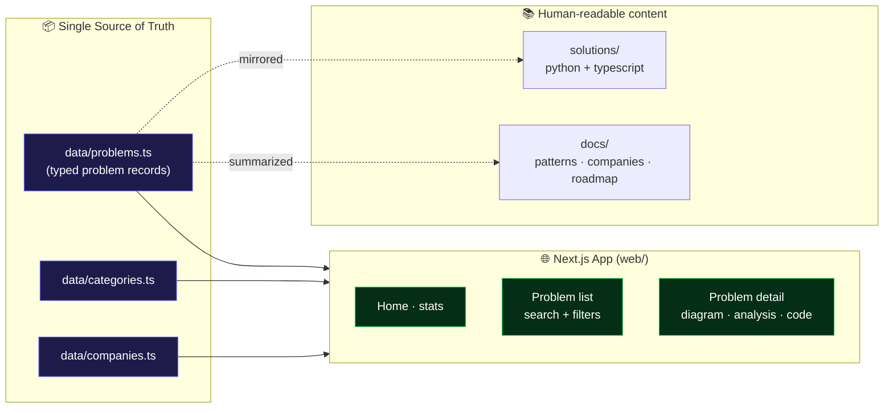
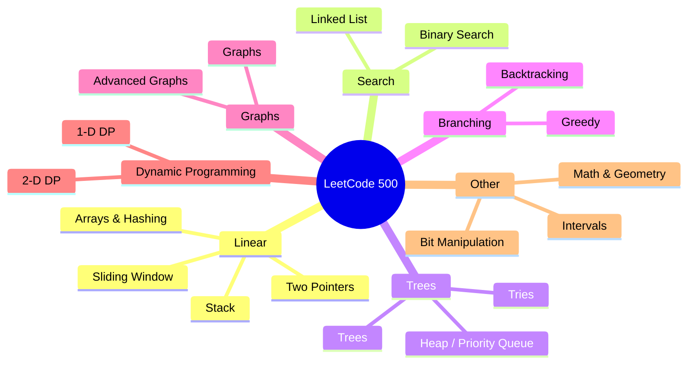
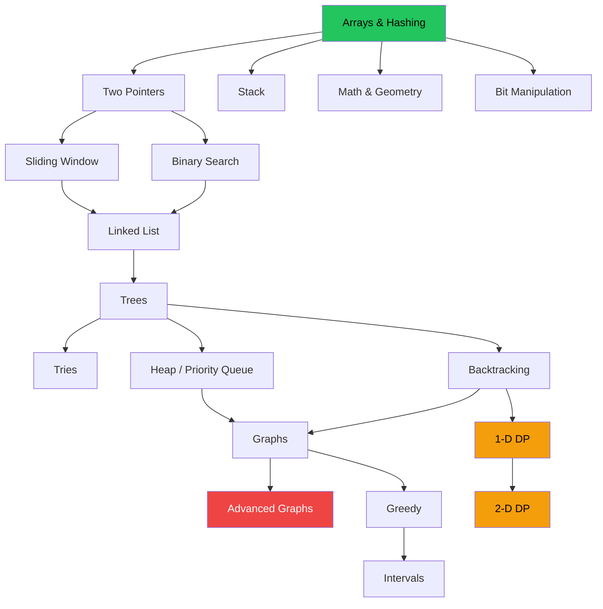

# 🧠 LeetCode 500 — The 2025–2026 Interview Prep Repo

> A **full-stack**, data-driven study system for the **500 most frequently asked LeetCode
> questions** of the 2025–2026 hiring cycle — categorized by pattern, mapped to the companies
> that ask them, and explained with diagrams, complexity analysis, and clean multi-language
> solutions.

<p align="center">
  
  
  
  
</p>

---

## ✨ What's inside

| Layer | What it gives you |
| --- | --- |
| 📊 **Structured dataset** | Every problem encoded with difficulty, pattern, companies, frequency, complexity, and runnable solutions in a single typed source of truth. |
| 🧩 **Pattern-first categorization** | 18 canonical patterns (Arrays & Hashing → DP → Graphs) so you learn *transferable techniques*, not 500 one-off tricks. |
| 🏢 **Company mapping** | Filter by Amazon, Google, Meta, Microsoft, Apple, Bloomberg, and 20+ more — see what *your* target company actually asks. |
| 📝 **Deep explanations** | Each problem has an intuition write-up, a Mermaid diagram, a worked example, and Big-O analysis. |
| 💻 **Multi-language solutions** | Idiomatic Python **and** TypeScript for every solved problem. |
| 🌐 **Next.js web app** | Browse, search, and filter the whole set in a fast, responsive UI with live diagrams and syntax-highlighted code. |

---

## 🏗️ Architecture



The **dataset is the single source of truth**. The web app imports it directly, and the
`solutions/` + `docs/` folders mirror it as plain files so the repo is useful even without
running anything.

---

## 🗂️ The 18 patterns



See **[docs/categories.md](docs/categories.md)** for the full breakdown and counts.

---

## 🧭 Suggested study roadmap



Green = start here · Amber = high-leverage mid-game · Red = hardest, do last.

---

## 🌐 Run the web app

```bash
cd web
npm install
npm run dev
# open http://localhost:3000
```

Production build:

```bash
cd web
npm run build
npm start
```

---

## 📁 Repository structure

```text
leetcode-500/
├── README.md                 ← you are here
├── data/                     ← single source of truth (typed)
│   ├── types.ts              ← Problem / Category / Company models
│   ├── categories.ts         ← the 18 patterns
│   ├── companies.ts          ← company registry
│   └── problems.ts           ← the problem records
├── docs/                     ← analysis & explainers (with diagrams)
│   ├── categories.md
│   ├── patterns.md
│   ├── companies.md
│   └── roadmap.md
├── solutions/                ← standalone reference solutions
│   ├── python/
│   └── typescript/
└── web/                      ← Next.js 15 app (App Router + Tailwind)
    ├── src/app/
    ├── src/components/
    └── src/data/             ← re-exports the root dataset
```

---

## 🏢 Companies covered

Amazon · Google · Meta · Microsoft · Apple · Netflix · Bloomberg · Adobe · Uber · LinkedIn ·
Oracle · ByteDance/TikTok · Salesforce · Goldman Sachs · Nvidia · Atlassian · Stripe ·
Databricks · Snowflake · Airbnb · Doordash · Pinterest · Coinbase

Full mapping in **[docs/companies.md](docs/companies.md)**.

---

## 📈 How "frequency" works

Each problem carries a `frequency` score (0–100) approximating how often it has surfaced in
recent interview reports for the 2025–2026 cycle. It's a **relative heuristic** for
prioritization, aggregated from public interview-experience discussions — not an official
LeetCode statistic. Sort by it to spend your time where it counts.

---

## 🤝 Contributing / extending to the full 500

This repo ships a **curated, fully-explained core** plus a schema designed to scale to all 500.
To add a problem, append one typed record to [data/problems.ts](data/problems.ts) — the web app,
docs, and filters pick it up automatically. See **[docs/roadmap.md](docs/roadmap.md)** for the
contribution checklist.

---

## ⚖️ License & disclaimer

[MIT](LICENSE). Problem *statements* belong to LeetCode; this repo links to the originals and
provides original explanations, categorizations, and solutions for educational use.
