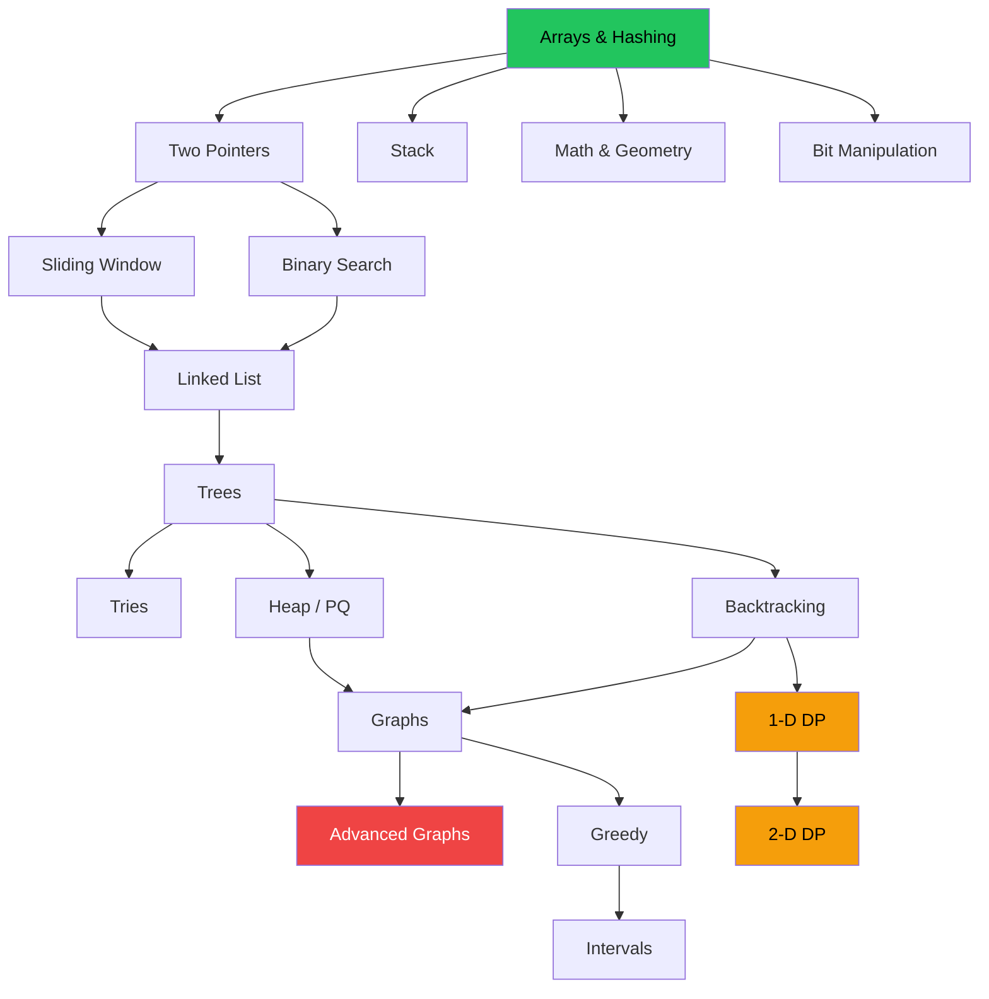

# 🧩 The 18 Patterns

Interview problems are not 500 unique puzzles — they're a few dozen **transferable
techniques** wearing different costumes. Learn to recognize the pattern and the solution
usually follows. This is the taxonomy used throughout the repo.

## Study order (dependency graph)

## Pattern reference

| # | Pattern | Use it when… | Core trick |
| --- | --- | --- | --- |
| 1 | 🔢 Arrays & Hashing | You need O(1) lookup, counting, or de-duping | Hash map / set, prefix sums |
| 2 | ↔️ Two Pointers | Data is sorted or symmetric; you compare ends | Converge `l`/`r`, fast/slow |
| 3 | 🪟 Sliding Window | "Longest/shortest/best contiguous …" | Expand right, shrink left |
| 4 | 📚 Stack | Matching, nesting, or "next greater" | LIFO, monotonic stack |
| 5 | 🔍 Binary Search | Sorted input **or** monotonic answer space | Halve the range; search the answer |
| 6 | 🔗 Linked List | In-place pointer rewiring | Dummy head, fast/slow |
| 7 | 🌳 Trees | Hierarchical/recursive structure | DFS / BFS, divide & conquer |
| 8 | 🔤 Tries | Prefix search, autocomplete, word dictionaries | Char-path tree + end flag |
| 9 | ⛰️ Heap / PQ | Top-K, streaming min/max, merge K | Min/max-heap, two heaps |
| 10 | 🎯 Backtracking | Enumerate subsets/permutations/combos | Choose → recurse → undo |
| 11 | 🕸️ Graphs | Networks, grids, connectivity | BFS/DFS, topological sort |
| 12 | 🧭 Advanced Graphs | Weighted shortest path, MST, DSU | Dijkstra, Union-Find, Prim/Kruskal |
| 13 | 📈 1-D DP | Optimal substructure on one axis | `dp[i]` from prior states |
| 14 | 🧮 2-D DP | Two sequences or a grid | `dp[i][j]` table |
| 15 | 💰 Greedy | A local choice provably stays optimal | Sort + exchange argument |
| 16 | 📅 Intervals | Overlaps, merging, scheduling | Sort by start/end, sweep |
| 17 | 📐 Math & Geometry | Number theory, matrix transforms | Modular math, in-place tricks |
| 18 | 🔟 Bit Manipulation | Uniqueness, masks, fast arithmetic | XOR, `n & (n-1)`, bitmask |

## Complexity cheat sheet

| Operation | Array | Hash map | Balanced BST | Binary heap |
| --- | --- | --- | --- | --- |
| Access by index | O(1) | — | — | — |
| Search | O(n) | O(1) avg | O(log n) | O(n) |
| Insert | O(n) | O(1) avg | O(log n) | O(log n) |
| Delete | O(n) | O(1) avg | O(log n) | O(log n) |
| Min / Max | O(n) | O(n) | O(log n) | O(1) peek |

> Rule of thumb for the typical `1 ≤ n ≤ 10^5` constraint: an `O(n log n)` solution is
> comfortable, `O(n²)` is usually too slow.

See **[roadmap.md](roadmap.md)** for a week-by-week plan and **[companies.md](companies.md)**
for who asks what.
