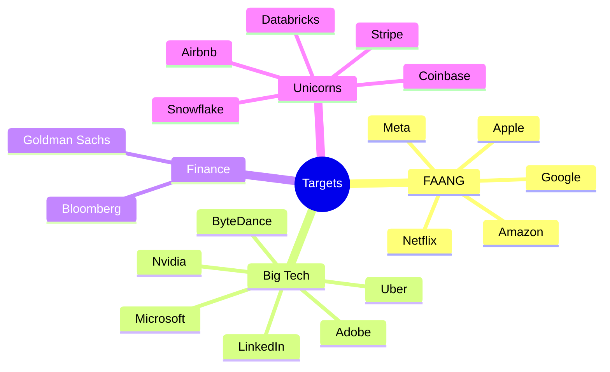

# 🏢 Companies & what they ask

Different companies lean on different patterns. This page summarizes the **observed
tendencies** for the 2025–2026 cycle and points you at the live filter in the web app for
the exact per-company problem list.

> **Methodology.** Company tags are aggregated from public interview-experience reports and
> are a *prioritization heuristic*, not an official or guaranteed list. Treat them as "study
> these first for this company," not "these are the only questions."

## Tiers

## Tendencies by company

| Company | Leans toward | Signature picks in this repo |
| --- | --- | --- |
| **Amazon** | Hashing, BFS/DFS, Greedy, DP | Two Sum, Number of Islands, Coin Change, Merge Intervals |
| **Google** | Graphs, DP, Backtracking, Math | 3Sum, Coin Change, Network Delay Time, Subsets |
| **Meta** | Two Pointers, Trees, Hashing | Valid Palindrome, 3Sum, Subsets, Maximum Subarray |
| **Microsoft** | Linked Lists, Trees, Strings | Reverse Linked List, Max Depth, LCS, Binary Search |
| **Apple** | Arrays, Stacks, Design | Two Sum, Valid Parentheses, Climbing Stairs |
| **Bloomberg** | Hashing, Intervals, Strings | Group Anagrams, Merge Intervals, Daily Temperatures |
| **Uber** | Graphs, Greedy, Intervals | Number of Islands, Group Anagrams, Network Delay Time |
| **LinkedIn** | Trees, Heaps, DP | Max Depth, Kth Largest, House Robber |
| **Stripe / Fintech** | Hashing, Intervals, Simulation | Merge Intervals, Product of Array Except Self |

## How to use this

1. Open the web app and filter by your target company.
2. Sort by **frequency** to triage.
3. Drill the top patterns that company favors (column above) using
   **[roadmap.md](roadmap.md)**.
4. Practice each in the **[playground](../web)** until you can re-derive it from scratch.

> The precise company→problem mapping lives in
> [`data/companies.ts`](../data/companies.ts) and each problem's `companies` field in
> [`data/problems.ts`](../data/problems.ts).
