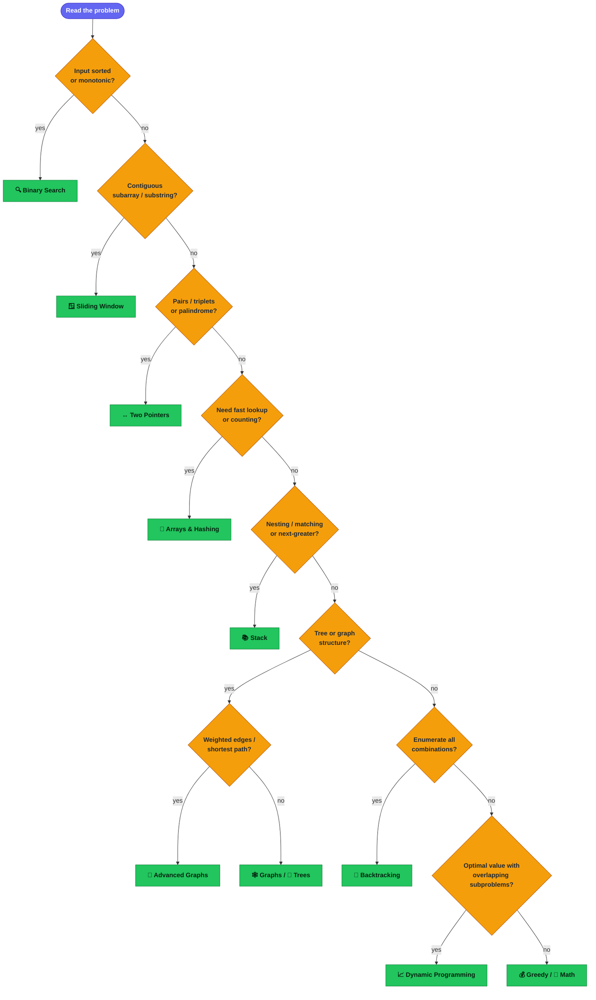

# 🔎 How to recognize the pattern

The hardest part of an interview is often **mapping a new problem to a known technique**.
Use the cues below — they resolve the large majority of questions.

## Decision flow

## Keyword → pattern cheat sheet

| If the prompt says… | Reach for |
| --- | --- |
| "sorted array", "find the boundary", "minimize the maximum" | 🔍 Binary Search |
| "longest/shortest substring", "window", "at most K" | 🪟 Sliding Window |
| "two numbers", "pair", "palindrome", "remove duplicates in place" | ↔️ Two Pointers |
| "count occurrences", "seen before", "group by" | 🔢 Arrays & Hashing |
| "valid parentheses", "next greater", "evaluate expression" | 📚 Stack |
| "level order", "ancestor", "path sum" | 🌳 Trees |
| "prefix", "autocomplete", "dictionary of words" | 🔤 Tries |
| "top K", "K closest", "median of a stream", "merge K" | ⛰️ Heap |
| "all permutations/combinations/subsets", "generate every…" | 🎯 Backtracking |
| "islands", "connected", "shortest steps", "course schedule" | 🕸️ Graphs |
| "cheapest/fastest path with weights", "minimum spanning tree" | 🧭 Advanced Graphs |
| "number of ways", "min/max cost", "can you reach" | 📈/🧮 DP |
| "maximum profit with one local choice", "intervals" | 💰 Greedy / 📅 Intervals |
| "appears once", "without using +", "power of two" | 🔟 Bit Manipulation |

## A reliable problem-solving loop

1. **Restate** the problem in your own words and write 1–2 tiny examples.
2. **Brute force first** — get *a* correct solution and its complexity.
3. **Find the bottleneck** — what is the brute force repeating?
4. **Match a pattern** using the cues above to remove that repetition.
5. **Dry-run** on an edge case (empty, single element, all duplicates).
6. **Code, then test** in the [playground](../web) against the provided cases.

> See **[categories.md](categories.md)** for the pattern reference and
> **[roadmap.md](roadmap.md)** for a study schedule.
