# 🗺️ Study roadmap

A practical plan to work through the patterns, plus how to extend the dataset toward the
full 500.

## 8-week plan

| Week | Focus | Patterns | Goal |
| --- | --- | --- | --- |
| 1 | Foundations | Arrays & Hashing, Two Pointers | Hash-map fluency; converging pointers |
| 2 | Windows & stacks | Sliding Window, Stack | Variable windows; monotonic stack |
| 3 | Search & lists | Binary Search, Linked List | Search-the-answer; pointer surgery |
| 4 | Trees | Trees, Tries, Heap | DFS/BFS; top-K |
| 5 | Branching | Backtracking, Greedy | Decision trees; exchange arguments |
| 6 | Graphs | Graphs, Advanced Graphs | BFS/DFS, topo sort, Dijkstra, DSU |
| 7 | DP | 1-D DP, 2-D DP | Recurrences; tabulation |
| 8 | Polish | Intervals, Math, Bits + review | Mixed mock sets |

```mermaid
gantt
    title 8-week interview prep
    dateFormat  X
    axisFormat %s
    section Core
    Arrays & Two Pointers      :0, 1
    Sliding Window & Stack     :1, 1
    Binary Search & Lists      :2, 1
    Trees / Tries / Heap       :3, 1
    section Advanced
    Backtracking & Greedy      :4, 1
    Graphs                     :5, 1
    Dynamic Programming        :6, 1
    Intervals / Math / Review  :7, 1
```

## Daily loop

- **2–3 problems/day**, highest `frequency` first within the week's pattern.
- Always: brute force → bottleneck → pattern → code → **run tests in the playground**.
- Re-attempt any problem you needed a hint for after 48 hours.
- Keep a one-line "trigger note" per problem ("sorted → binary search on answer").

## Definition of "done" for a problem

You can, from a blank editor:

1. Restate it and give a tiny example.
2. State the pattern and why it applies.
3. Write the solution and pass the playground tests.
4. State time/space complexity and one edge case.

## Extending toward the full 500

The dataset is a typed array; adding a problem is one record. Checklist:

- [ ] Append a `Problem` object to [`data/problems.ts`](../data/problems.ts).
- [ ] Fill `category`, `patterns`, `companies`, and a `frequency` estimate.
- [ ] Write an original `statement`, `intuition`, ordered `approach`, and `pseudocode`.
- [ ] Add a colorful Mermaid `diagram` (use the `classDef` palette from existing problems).
- [ ] Provide `solutions` (Python + TypeScript) and a `runner` (entry + JS reference + starter).
- [ ] Add `tests` covering a normal case, an edge case, and a tricky case.
- [ ] Run `npm run gen:solutions` to refresh the standalone files.
- [ ] The web app, filters, search, and playground pick it up automatically.

> Patterns reference: **[categories.md](categories.md)** · Pattern recognition:
> **[patterns.md](patterns.md)** · Company targeting: **[companies.md](companies.md)**.
